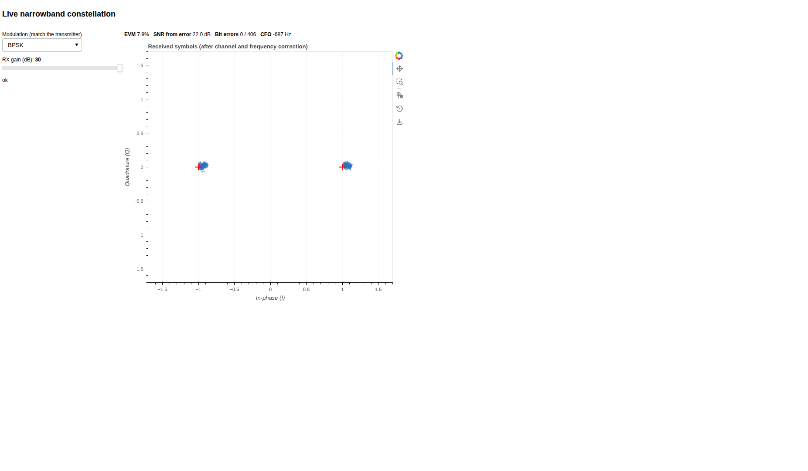
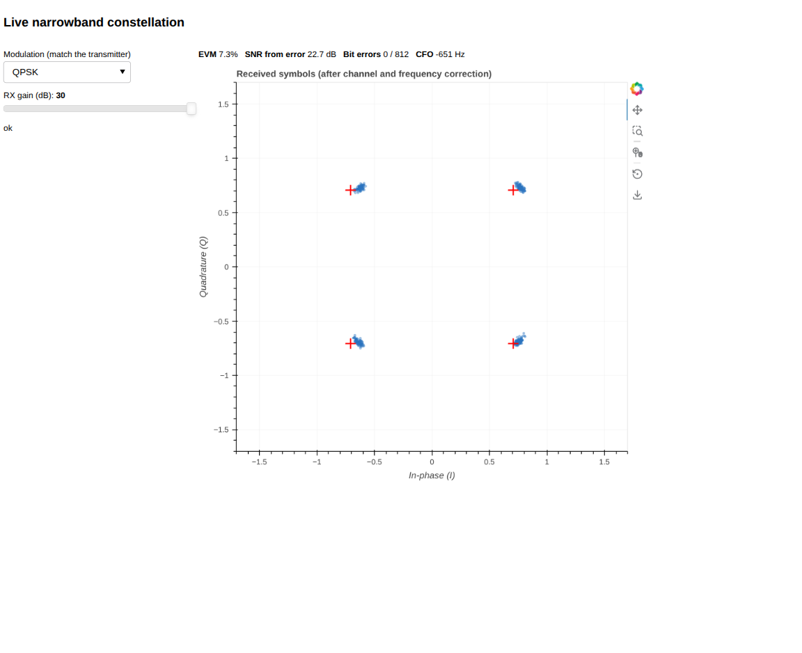
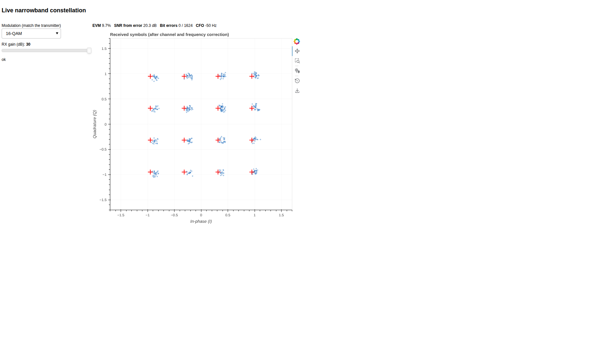

# Digital modulation: constellations and noise

This experiment explores digital modulation schemes (BPSK, QPSK, 16-QAM), and how they behave as the signal-to-noise ratio changes.

We will send a known data sequence over a single narrowband carrier, receive it with a software defined radio, and look at the constellation diagram - the scatter of received symbols in the complex plane - at a series of receive signal levels. We will connect what we see to the error-vector magnitude (EVM), the bit error rate, and the signal-to-noise ratio (SNR).

It should take about 60-120 minutes to run this experiment, but you will need to have reserved that time in advance. This experiment uses wireless resources  - either the sb5 sandbox at [COSMOS](http://cosmos-lab.org), or the sb7 sandbox at [COSMOS](http://cosmos-lab.org) - and you can only use wireless resources during a reservation.

To run this experiment, you will need a COSMOS account, and you will need to have joined a project. You should have already uploaded your SSH keys to your profile. (If you haven't used COSMOS before, you may want to first go through [Hello, COSMOS](https://ffund.github.io/hello-opencode/).) Finally, you must have reserved time on the sandbox, and you must run this experiment during your reserved time.

- Skip to [Results](#results)
- Skip to [Run my experiment](#run-my-experiment)

## Background

A digital modulation scheme maps groups of bits to a finite set of complex signal values, or "signal levels." This experiment uses three schemes with increasing numbers of signal levels:

- **BPSK** (2-PSK): 1 bit per symbol; two constellation points at opposite sides of the complex plane.
- **QPSK** (4-PSK): 2 bits per symbol; four constellation points.
- **16-QAM**: 4 bits per symbol; sixteen constellation points.

When we map bits to points in the complex plane, we call the set of possible points the constellation. The constellation of BPSK has two points; QPSK has four; 16-QAM has sixteen.

The receiver does not know exactly which point was transmitted; it only sees the received value. In the absence of noise, the received value lands exactly on one of the constellation points. In the presence of noise, it lands near the constellation point, and we can see the points as clouds on the constellation diagram.

<!-- 
You can interact with this below. Move the noise level slider to the right, and watch how the three constellations respond: the clouds widen for all of them, but the clouds of the higher-order constellations begin to overlap at lower noise levels, because their points are packed more closely together.

<iframe src="images/constellation-snr.html" style="width:100%; height:620px; border:1px solid #ccc; border-radius:8px;" title="Constellation vs noise interactive figure"></iframe>

-->

The number of signal levels has a cost, however: as the number of levels increases, the points from adjacent symbols get closer together, and it takes less noise to make the receiver confuse one symbol for another. So higher-order modulation delivers more data per symbol, but is more vulnerable to noise.

This is quantified by the error vector magnitude (EVM): the RMS distance from each received symbol to the nearest ideal constellation point, normalized by the constellation's average power. It is the cloud radius as a number, and it is directly measurable from the received signal. For an ideal AWGN channel, the EVM determines the signal-to-noise ratio:

$$ SNR[dB] \\approx -20 \\log_{10}(EVM/100) $$

where EVM is expressed as a percentage.

Because the bit error rate (BER) for a given modulation scheme is a known function of the signal-to-noise ratio (SNR)—for example, for BPSK and QPSK, BER ≈ Q(sqrt(2·Eb/N0))—the EVM measured from the received constellation can be used to estimate the effective SNR and, in turn, predict the BER. This predicted error rate can then be compared with the error rate actually observed at the receiver.

## Results

When we run the experiment at high SNR, we see a constellation with the correct number of clouds: BPSK has two points, QPSK has four, and 16-QAM has sixteen. 










As we reduce the signal level, the clouds become wider, the measured EVM increases, and the measured error rate rises. On sb7, reducing TX gain alone may not reach that point; reducing `--amplitude` provides a wider low-SNR range.

<!-- 
The live browser scope was verified on sb7 (N210 with SBX daughterboards) at 2.4 GHz and 20 dB transmit gain. The ideal constellation points are marked with red crosses, and the received symbols form clouds around them. Representative measurements were:

| Modulation | EVM | SNR from error | Bit errors |
| --- | ---: | ---: | ---: |
| BPSK | 7.7% | 22.2 dB | 0 / 406 |
| QPSK | 7.1% | 23.0 dB | 0 / 812 |
| 16-QAM | 8.5% | 21.4 dB | 0 / 1624 |

These are live known-frame measurements, rather than an offline plot of an unsynchronized capture. The browser scope also reports carrier-frequency offset and updates as the received frames arrive.

-->

The SNR at which errors start is different for each modulation. We expect to see that BPSK is the most robust (needs the lowest SNR), QPSK is next, and 16-QAM is the least robust.

## Run my experiment

To run this experiment, you need a reservation on a sandbox. You will have to make your reservation in advance. The experiment works on either the sb5 sandbox (USB USRP B210) or the sb7 sandbox (Ethernet USRP N210 with SBX daughterboards); the instructions below give both where they differ.

### Set up testbed

At your reserved time, open a terminal and log in to the console of the testbed that you have reserved:

If you are using sb5, run

```
# runs on your workstation
ssh YOUR_USERNAME@sb5.cosmos-lab.org
```

If you are using sb7, run

```
# runs on your workstation
ssh YOUR_USERNAME@sb7.cosmos-lab.org
```

Then, you must load a disk image onto the testbed nodes. From the testbed console, run:

```
# runs on the sb5 or sb7 console
omf tell offs -t node1-1,node1-2
omf load -i baseline-sdr.ndz -t node1-1,node1-2
```

This disk image has the [GNU Radio](http://gnuradio.org/) software suite, the USRP/UHD drivers, and the SoapySDR abstraction layer (including the SoapySDR UHD support module) pre-installed.

This process can take 5-10 minutes. Don't interrupt it in middle - you'll just have to start again, and it will only take longer.

If it's been successful, then once the process finishes running completely you should see output similar to:

```
 INFO exp:  -----------------------------
 INFO exp:  Imaging Process Done
 INFO exp:  2 nodes successfully imaged - Topology saved in '/tmp/omf-pxe_slice-XXXX-topo-success.rb'
 INFO exp:  -----------------------------
```

Sometimes, transient errors can cause the process to fail - if you haven't successfully imaged 2 nodes, wait a few minutes and try again.

Then, turn on your nodes with the following command:

```
# runs on the sb5 or sb7 console
omf tell on -t node1-1,node1-2
```

Wait a few minutes for your testbed nodes to turn on, then continue with the experiment.

### Get the lab files

From the testbed console, open a shell on the receiver node:

```
# runs on the sb5 or sb7 console
ssh root@node1-1
```

In a second terminal, open a shell on the transmitter node:

```
# runs on the sb5 or sb7 console
ssh root@node1-2
```

Run the clone command in each node shell:

```
# runs on node1-1 and on node1-2
git clone https://github.com/teaching-on-testbeds/digital-modulation.git
```

The repository contains the lab instructions, source code, and radio profiles.

On the receiver node, install Bokeh in a virtual environment. The environment keeps Bokeh separate from the GNU Radio packages supplied by the disk image:

```
# runs on node1-1
apt-get update
apt-get -y install python3-venv
python3 -m venv --system-site-packages /root/dm-venv
/root/dm-venv/bin/pip install bokeh==3.10.0
```

### Run the experiment

The transmitter runs on `node1-2`; the receiver runs on `node1-1`. Both must be set to the same frequency and the same number of signal levels (`-p`).

If you are using sb7, the N210 is an Ethernet device on the 192.168.10.x subnet, attached to the `enp4s0` interface on the node. Assign the interface IP on each node, right after you log in to it:

```
# runs on node1-1 and on node1-2
ip addr add 192.168.10.1/24 dev enp4s0
```

(If the address is already set, the command will report that it already exists, which is fine.)


#### Start the transmitter

Now, we will start the transmitter.

If you are using sb5 (B210), run

```
# runs on node1-2
time python3 /root/digital-modulation/src/dm_tx.py -f 2400e6 -p 2 --tx-gain 89 \
  --args type=b200 --subdev A:A
```

If you are using sb7 (N210), run

```
# runs on node1-2
time python3 /root/digital-modulation/src/dm_tx.py -f 2400e6 -p 2 \
  --tx-gain 20 --args addr=192.168.10.2 --subdev A:0
```

The `-p` argument sets the number of signal levels (2 = BPSK, 4 = QPSK, 16 = 16-QAM), `--tx-gain` sets the transmit gain in dB, and `--amplitude` sets the digital waveform amplitude. On sb7, the SBX transmit gain range is 0-31.5 dB, so use values like 20, 15, 10, 5, 0. On sb5, the B210 transmit gain goes up to 89 dB, so you can use values like 89, 83, 77, 71, 65.

#### Choose a receiver workflow

The scope opens the USRP on the receiver node. UHD allows only one receiver process to use that radio at a time. The browser itself does not access the radio. It displays measurements produced by the scope process.

##### Live browser scope

We will visualize the live constellation using a "scope"! Start the scope on the receiver node:

```
# runs on node1-1
cd /root/digital-modulation/src
/root/dm-venv/bin/bokeh serve dm_scope.py --port 5006 --allow-websocket-origin=localhost:15006 \
  --args --freq 2400e6 \
  --args addr=192.168.10.2 --subdev A:0 --gain 30
```

Keep that terminal running. From your laptop, open a second terminal and create an SSH tunnel to the receiver node:

```
# runs on your workstation
ssh -N -J YOUR_USERNAME@sb7.cosmos-lab.org \
  -L 15006:127.0.0.1:5006 root@node1-1
```

Open `http://localhost:15006/dm_scope` in your browser. Select the same modulation as the transmitter (initially, BPSK) so that the scope knows what the "ideal" constellation should be. The scope synchronizes to the repeated known frame and displays the constellation, EVM, SNR, bit errors, and CFO.

#### Reduce the transmit gain and repeat

Repeat for each modulation: Run through each of BPSK (`-p 2`), QPSK (`-p 4`), and 16-QAM (`-p 16`). (Stop and re-start the transmitter between runs.)

Leave the scope running. Stop and restart the transmitter with a lower gain, wait for the scope to update, and take a screenshot. If the clouds remain tight at the minimum gain, restart the transmitter with `--amplitude 0.05`, then `--amplitude 0.01`.

Repeat the sequence for decreasing transmit gains and, when needed, decreasing amplitudes until the clouds become difficult to distinguish.

Organize your screenshots in a table of constellation diagrams:

* one column each for BPSK, QPSK, and 16-QAM
* one row for each transmit gain or amplitude you tried, starting from high signal level until the lowest row shows extremely high error

**Lab report**: Include the screenshot table. For each row, record the TX gain or amplitude and the EVM, SNR, bit errors, and CFO shown by the scope.

Explain why the clouds expand as the signal level falls. Compare the robustness of BPSK, QPSK, and 16-QAM. Explain why reducing `--amplitude` changes the visible SNR even though the scope normalizes the constellation radius.
